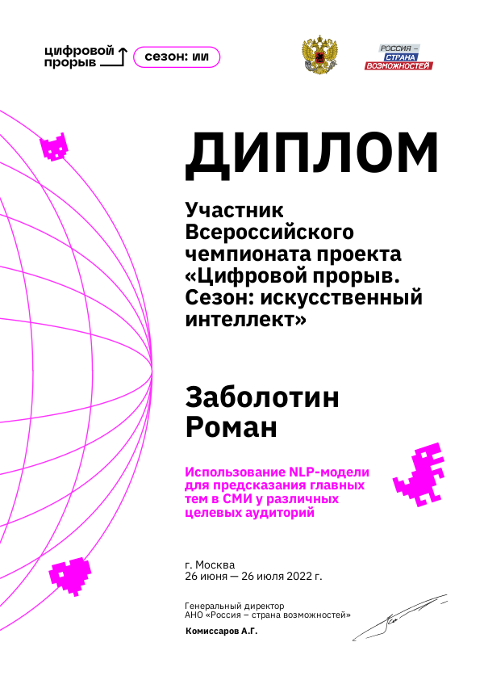

## Соревнование Цифровой прорыв 2022

- Участник: **Заболотин Роман**
- Место: **25 из 97**
- Результат на лидерборде **0.685924**
- Результат на приватном: **0.67**

Решение:

- [Ноутбук с финальным решением](Final%20notebook.ipynb)
- [Файл с классами и фукциями](utils.py)
- [Рабочие ноутбуки (EDA, поиск оптимальной модели, эксперименты)](working_notebooks)

Тизер:
 
- Я решал задачу предсказания метрик для новостного текста (количетво просмотров, процент полных прочтений, объем прочитанного материала)
- Я разделил задачу на 2 части: подготовка данных в формат удобный для машинного обучения и непосредственно обучение модели
- Я провел EDA исходных данных и выделил полезные признаки, а также подумал какие преобразования стоит к ним применить
- В результате исследований написал класс `RBKPreprocessor`, который преобразует данные полученные из csv файла в sparse матрицу, удобную для машинного обучения
- Он реализован на основании класса `sklearn.BaseEstimator` имеет методы fit и transform
- Основные преобразования:
  - Заголовок преобразовал через TfIdf, убрал стоп-слова, сделал лемматизацию
  - Выделил признаки из даты
  - Теги и авторов тоже преобразовал через TfIdf
  - В заголовке нашел дополнительную категорию (в конце заголовка)
- В качестве модели выбрал `CatBoostRegressor`
- Для каждого признака тренировал отдельную модель, а потом объединял их в один набор
- В качестве обучения использовал обучение с валидацией, чтобы избежать переобучения модели
- Также я сделал небольшой ансамбль из 4-х моделей, натренированных на разных фолдах
- В качестве предсказания - усреднил ответы всех моделей
- Не использовал внешние данные

